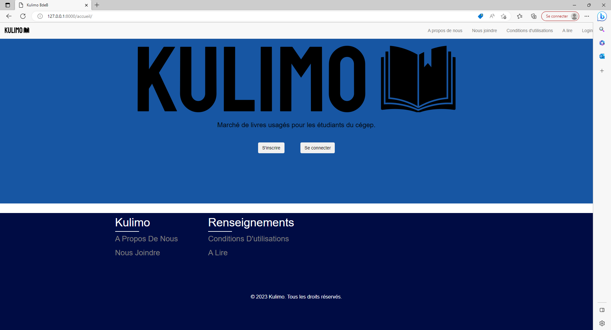
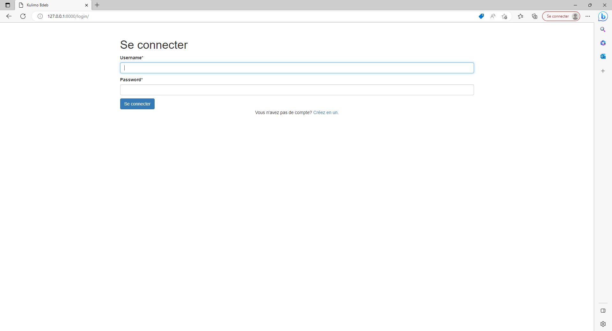
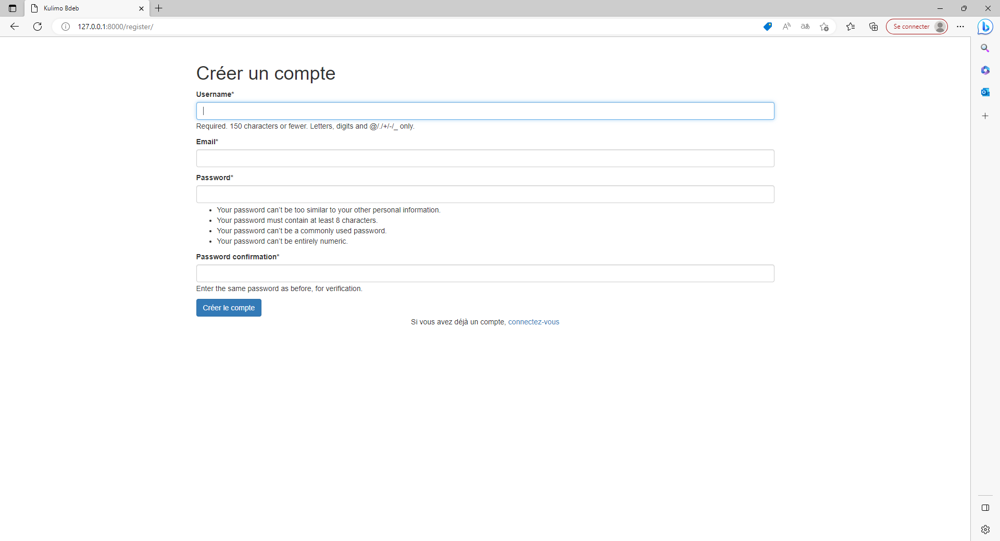

# Kulimo 

Ce projet a été créé par Anthony Lim, Karan Kumar et Benjamin Morin, dans le cadre du cours du projet d'intégration en sciences informatiques et mathématiques.

Notre projet est : 
- Un site web qui permet la facilité de la vente et l'achat de livres scolaires usagés et autres outils scolaires 
- Un site web qui permet de se créer un compte d'utilisateur et d'intéragir avec d'autres utilisateurs

<h2>Technologies utilisées :</h2>
    <li>Python</li>
    <li>Django</li>
    <li>Bootstrap</li>
    <li>HTML</li>
    <li>CSS</li>
    <li>Javascript</li>
    <li>Ajax</li>

<h2>Autres modules requis pour Python:</h2>
<ul>
    <li>Django</li>
    <li>django-crispy-forms</li>
    <li>crispy-bootstrap5</li>
    <li>Pillow</li>
</ul>

<h2>Utilisation :</h2>

    Faire un virtual environment : https://www.w3schools.com/django/django_create_virtual_environment.php

    Faire les installations requis : Python, Pip, Django, crispyforms, Pillow

    py -m pip install django-crispy-forms

    py -m pip install crispy-bootstrap5 
    
    py -m pip install Pillow

    Mettre dans le cmd : py manage.py runserver
    
   Dans votre navigateur web : http://localhost:8000 ou http://127.0.0.1:8000/

# Captures d'écran :

